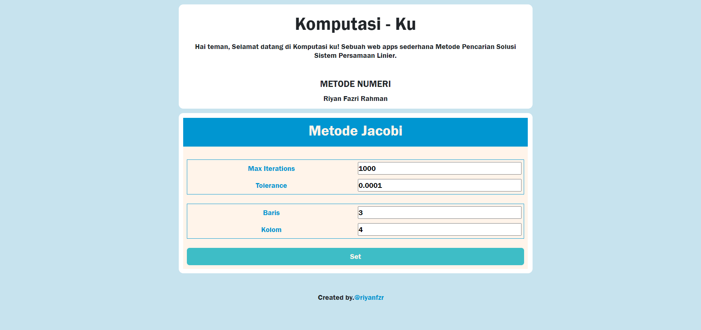

# Code Numerik Jacobi

Repository ini berisi kode-kode terkait numerik yang digunakan untuk memecahkan berbagai masalah matematika dan teknik. Kode-kode ini dapat digunakan sebagai referensi atau dasar untuk pengembangan aplikasi yang memerlukan perhitungan numerik.

## Fitur

- Implementasi berbagai algoritma jacobi
- Contoh penggunaan untuk setiap algoritma
- Struktur kode yang jelas dan mudah dipahami

## Penggunaan

Silakan lihat setiap file kode untuk memahami bagaimana cara penggunaan algoritma numerik yang telah diimplementasikan. Anda dapat menyesuaikan parameter sesuai kebutuhan Anda.

## Screenshots

## Teknologi yang Digunakan

  
